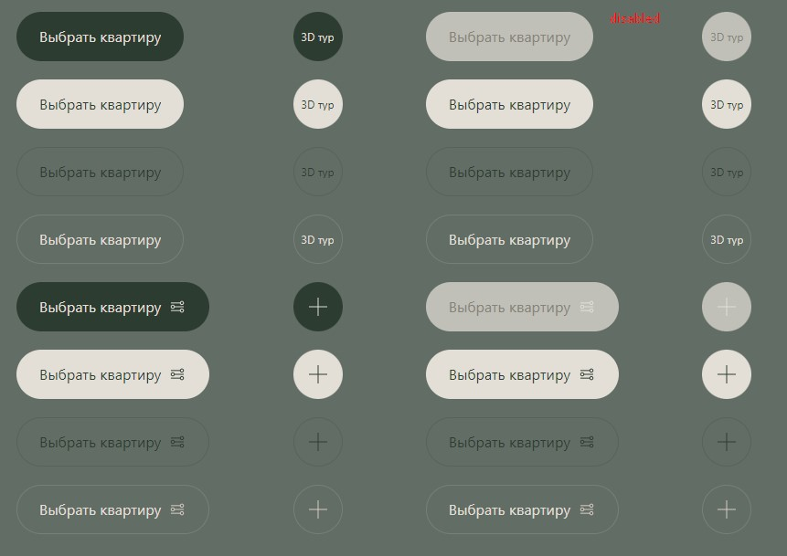

## Компонент кнопки на твиге

Зеленая по дефолту.

## Пропсы
- class: string, доп классы
- url: string, Адрес ссылки. Если данный пропс указан, то тег ссылки становится \<a>, по-умолчанию тег - \<button>;
- attributes: string, аттрибуты
- title: string, текст кнопки
- icon: string, иконка
- isOnline: boolean, мигающий кружок

### Модификаторы:

- `button--beige` - белый фон
- `button--bordered` - с границей
- `button--bordered-beige` - с границей белая

У кнопок есть следующие переменные:
  - --button-height - размер кнопки;
  - --button-border - цвет границ;
  - --button-bg-color - цвет фона;
  - --button-color - цвет текста;
  - --button-stroke - цвет иконки;
