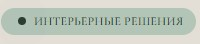

## Компонент кнопки-тега на твиге

Зеленая по дефолту.

## Пропсы
- class: string, доп классы
- url: string, Адрес ссылки. Если данный пропс указан, то тег ссылки становится \<a>, по-умолчанию тег - \<button>;
- attributes: string, аттрибуты
- title: string, текст кнопки
