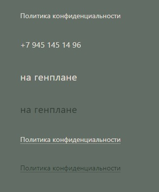

# Комопнент ссылки:

## Пропсы:
- class: string, Дополнительные классы, модификаторы;
- url: string, Адрес ссылки. Если данный пропс указан, то тег ссылки становится \<a>, по-умолчанию тег - \<button>;
- icon: string, иконка
- attributes: string, Дополнительные аттрибуты ссылки;

### Модификаторы:
- `link--underline` - граница снизу
- `link--green` - зеленая ссылка
- `link--is-fill` - иконка через фил
- `link--icon-left` - иконка слева

У кнопок есть следующие переменные:
  - --link-display-title - display текста;
  - --link-color - цвет текста;
  - --link-underline-color - цвет границы;
  - --link-underline-color-hover - цвет границы при ховере;
  - --link-stroke - цвет иконки;
  - --link-icon-left - отступ от текста;
