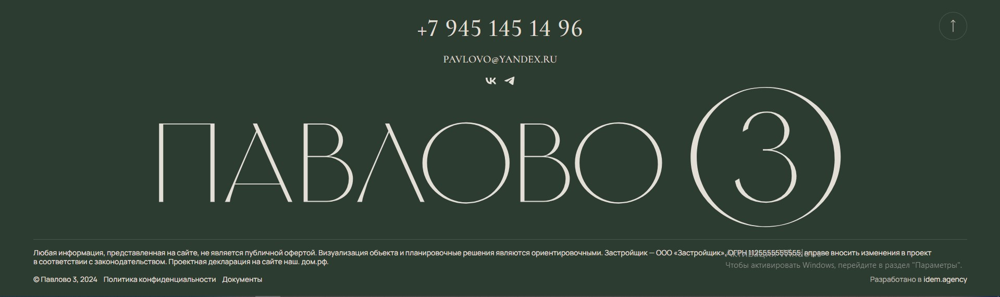

# Комопнент футер:

## Пропсы:
- class: string, Дополнительные классы, модификаторы;
- phone: string, номер телефона в футере;
- email: string, имейл в футере;
- socials: [пропсы социальных сетей](/src/views/shared/ui/socials/readme.md);
- description: string, описание в футере;
- copyright: string, текст копирайта;
- politics: [ссылка на политику конфеденциальности](/src/views/shared/ui/link/readme.md);
- documents: [ссылка на документы](/src/views/shared/ui/link/readme.md);
