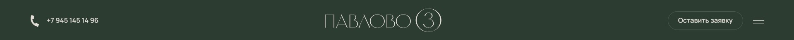

# Комопнент шапки:

## Пропсы:
- class: string, Дополнительные классы, модификаторы;
- phone: string, номер телефона в шапке;
- button: [пропсы кнопки](/src/views/shared/ui/button/readme.md), вызывающий обратную связь;
  - callback: [пропсы формы](/src/views/widgets/callback/readme.md);
- menu: [пропсы меню](./ui/menu/readme.md);
