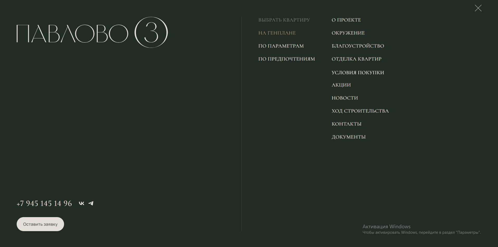

# Комопнент меню:

## Пропсы:
- class: string, Дополнительные классы, модификаторы;
- navigation: массив массивов навигации, каждый айтем это столбец ссылок;
  - subnav: массив сабнавигации
    - [пропсы ссылки](/src/views/shared/ui/link/readme.md);
  - [пропсы ссылки](/src/views/shared/ui/link/readme.md);
  - isActive: boolean, флаг, показывающий, что мы находимся на данной странице;
  - isQuiz: boolean, флаг, указывающий, что нужно открыть попап с квизов;
- socials: [пропсы социальных сетей](/src/views/shared/ui/socials/readme.md);
- button: [пропсы кнопки](/src/views/shared/ui/button/readme.md), вызывающий обратную связь;
  - callback: [пропсы формы](/src/views/widgets/callback/readme.md);
